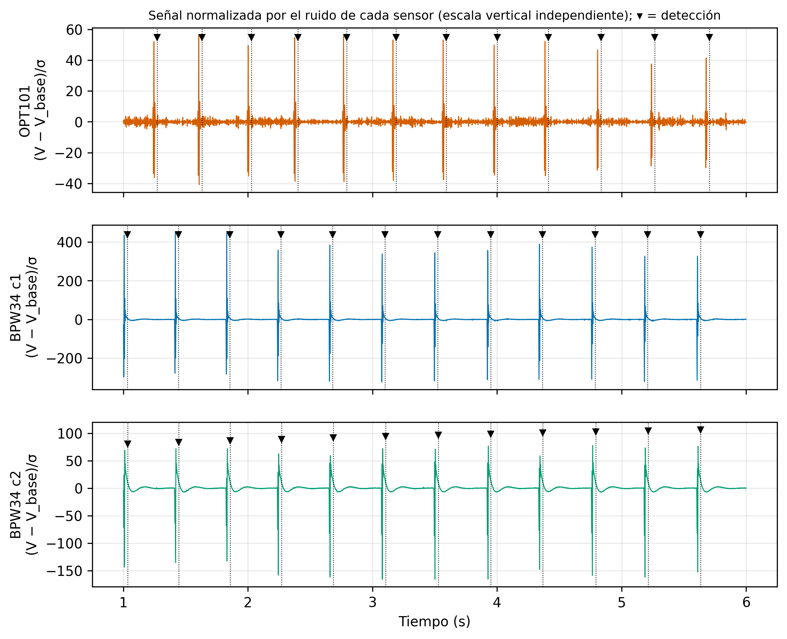
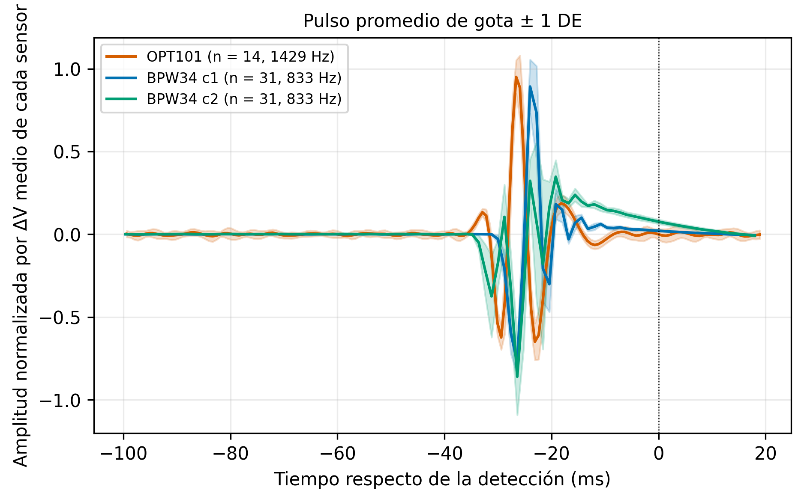
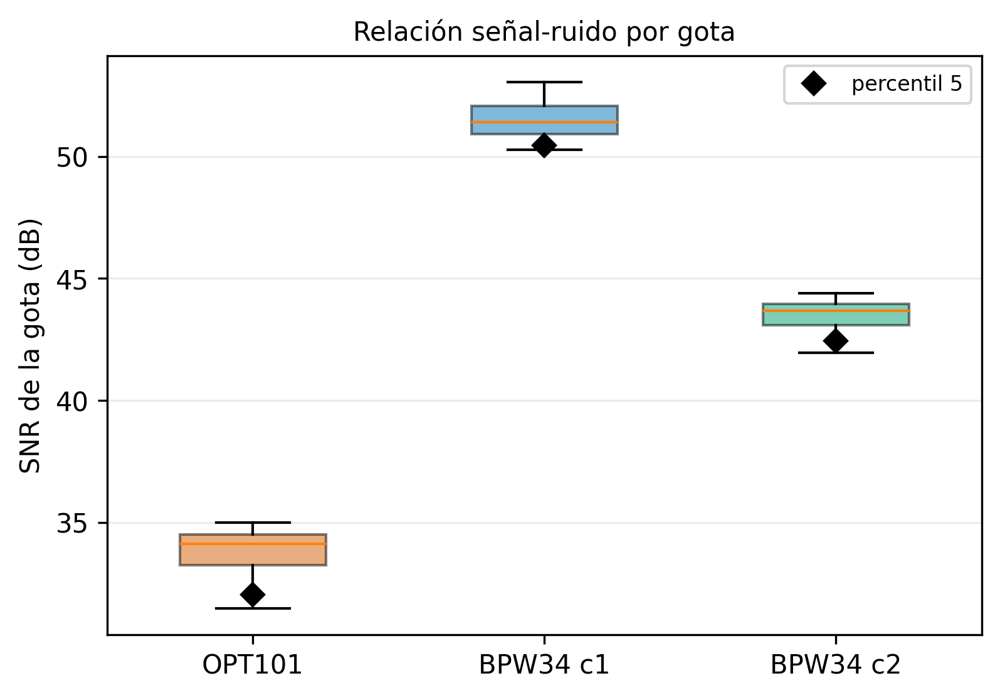
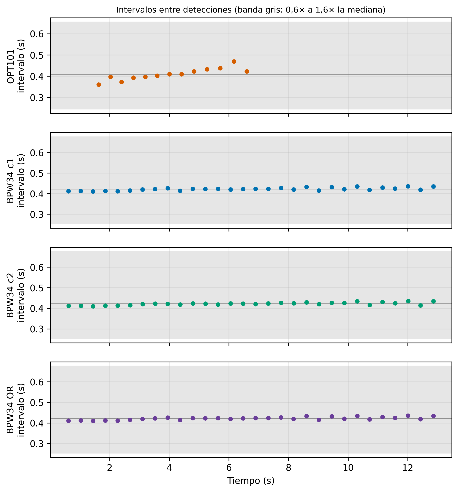
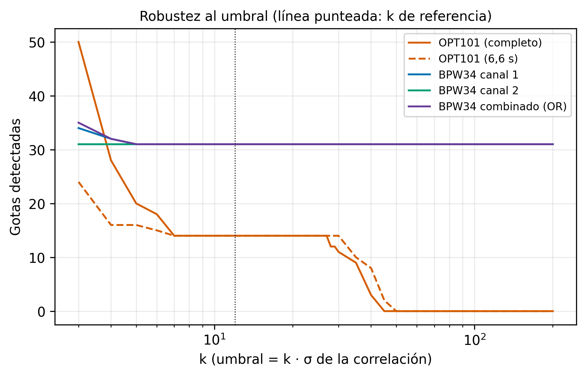
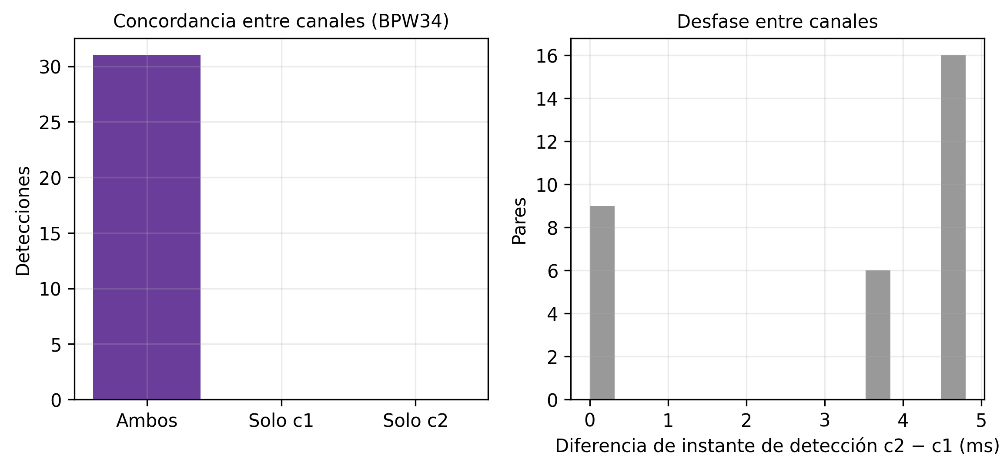
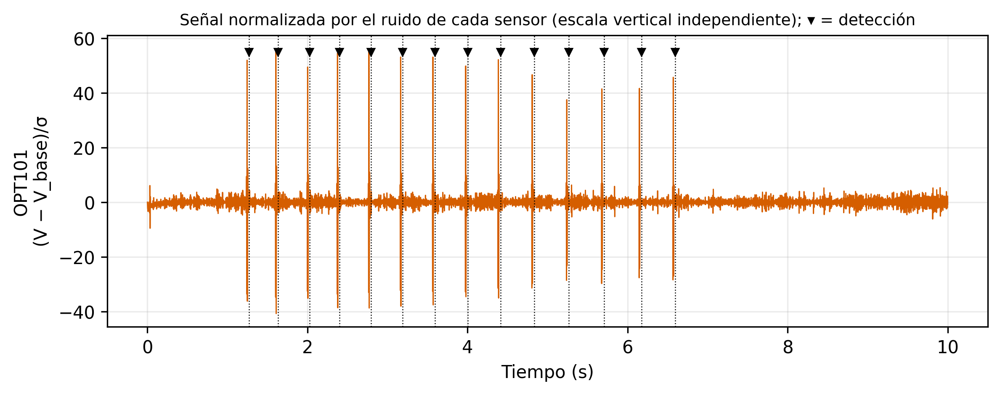
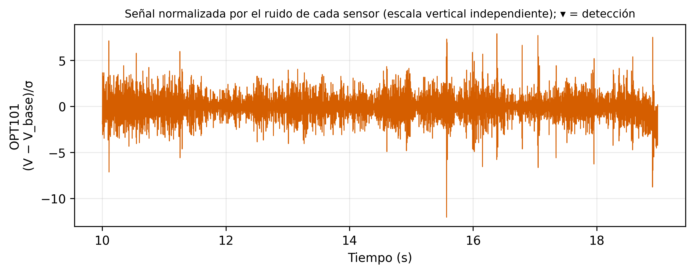
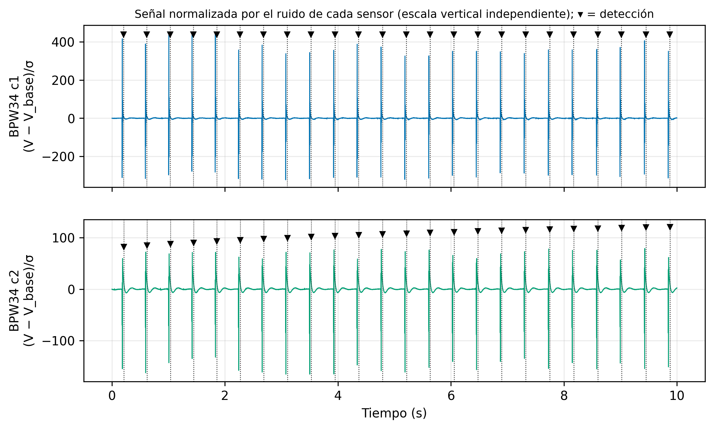
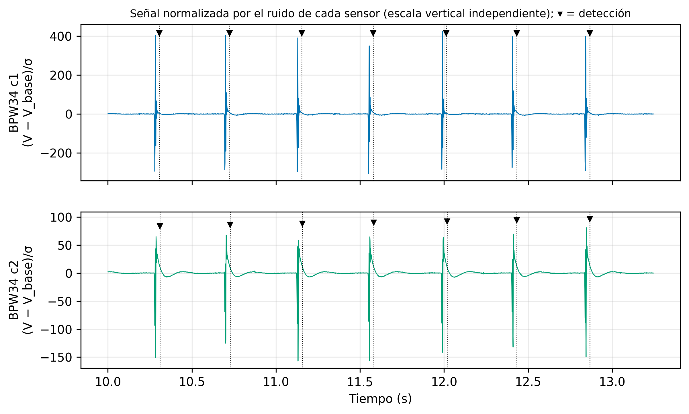

# Figuras de la comparación OPT101 vs BPW34

Se generan con `python analizar_deteccion.py` (PNG a 300 dpi y SVG en esta misma carpeta, `figuras/`). Colores fijos: OPT101 en naranja, BPW34 canal 1 en azul, canal 2 en verde y detección combinada en violeta.

## 1. Ventana representativa

Señal normalizada por el ruido de cada sensor (la escala vertical es independiente en cada panel). ▾ marca las detecciones.

## 2. Pulso promedio de la gota ± 1 DE

Alineado en la detección y normalizado por el ΔV medio de cada sensor. El OPT101 tiene más muestras por pulso por su período de muestreo (700 µs contra 1200 µs), lo que no implica mejor detección.

## 3. SNR por gota

El rombo negro marca el percentil 5.

## 4. Intervalos entre detecciones

La banda gris va de 0,6 a 1,6 veces la mediana.

## 5. Robustez al umbral

Gotas detectadas en función de k (umbral = k · σ de la correlación). La línea punteada es k = 12.

## 6. Concordancia entre canales del BPW34

## Figuras de revisión (10 s por sensor, con las detecciones marcadas)

OPT101:

BPW34:

